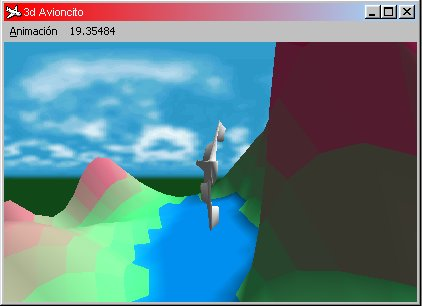



## Tutorial Direct3D en español

### Description

Explica como usar el Direct3D en español.
 
### More Info
 
nada

             |
---                |---
**Submitted On**   |2000-05-28 18:50:36
**By**             |[yeagerin](https://github.com/Planet-Source-Code/PSCIndex/blob/master/ByAuthor/yeagerin.md)
**Level**          |Intermediate
**User Rating**    |4.5 (27 globes from 6 users)
**Compatibility**  |VB 5\.0, VB 6\.0
**Category**       |[Games](https://github.com/Planet-Source-Code/PSCIndex/blob/master/ByCategory/games__1-38.md)
**World**          |[Visual Basic](https://github.com/Planet-Source-Code/PSCIndex/blob/master/ByWorld/visual-basic.md)
**Archive File**   |[CODE\_UPLOAD62465302000\.zip](https://github.com/Planet-Source-Code/yeagerin-tutorial-direct3d-en-espa-ol__1-8476/archive/master.zip)

